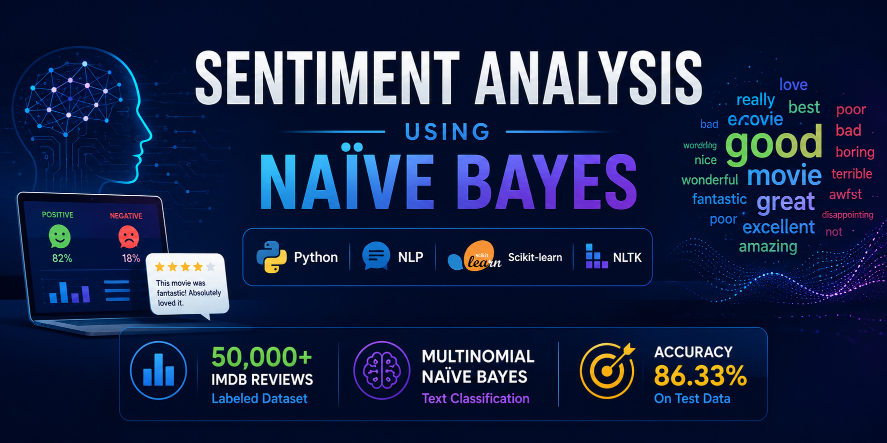

  

# sentiment-analysis-naive-bayes
Python NLP project for binary sentiment classification of IMDB movie reviews using Multinomial Naïve Bayes. Demonstrates text preprocessing, feature engineering, statistical classification, and evaluation using multiple performance metrics.

